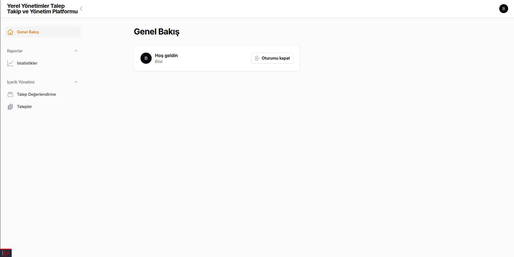
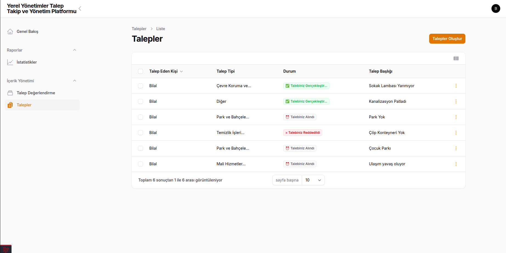
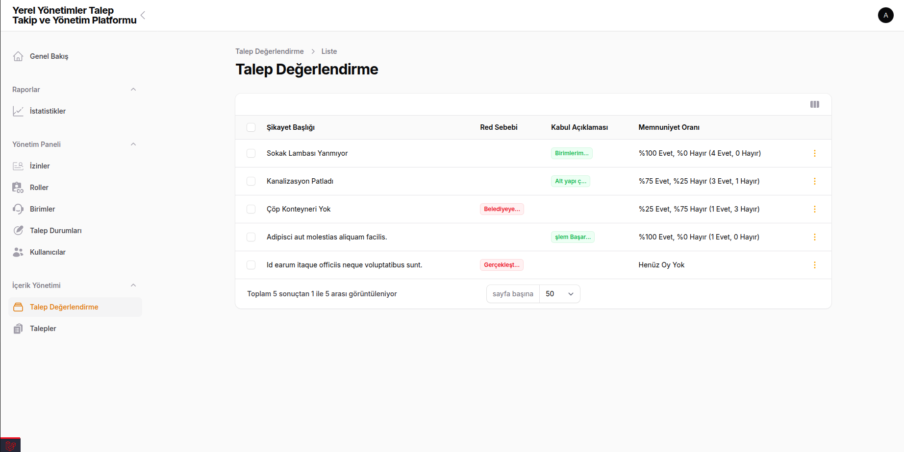
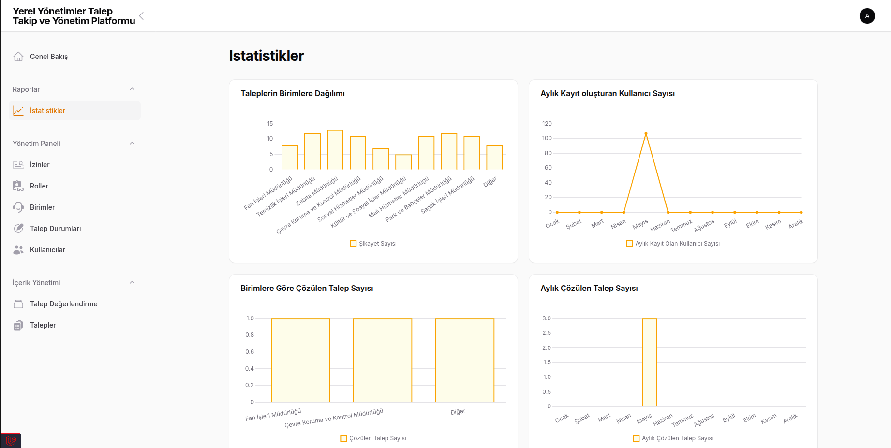
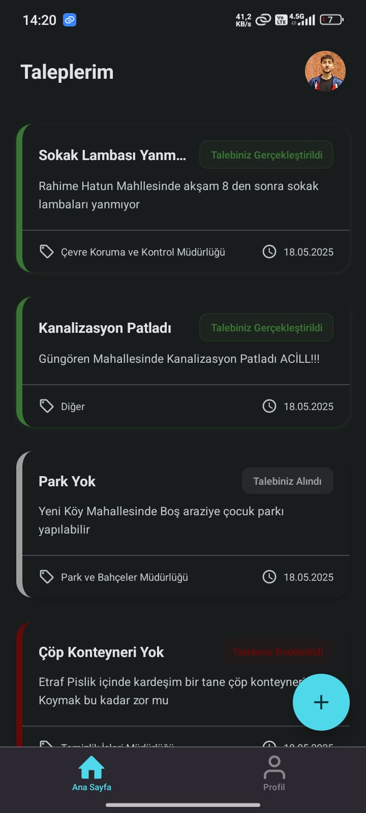
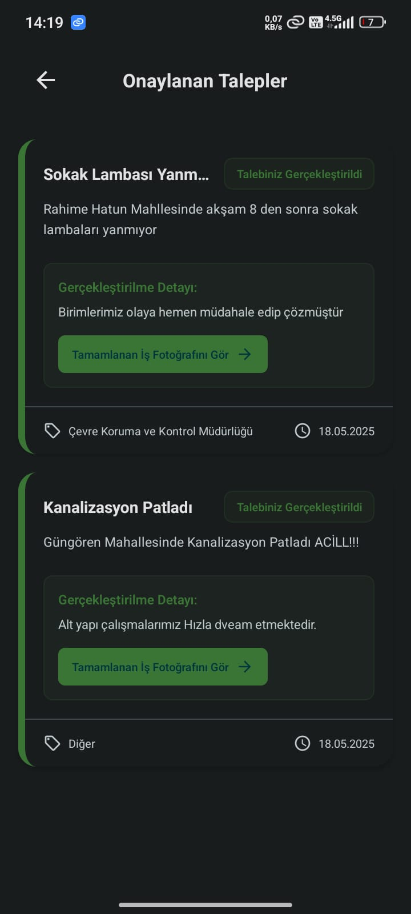

# Mezuniyet Projesi – Laravel + React Native Uygulaması

Bu proje, Laravel tabanlı bir **back-end** ve React Native tabanlı bir **mobil uygulama** içermektedir. Amaç, belediye süreçlerini dijitalleştiren bir otomasyon sistemidir.

---

## Proje Yapısı

├── graduationproject/ → Laravel Back-End
└── graduationMobileProject/ → React Native Mobile Uygulama
└── graduationproject.sql/ → SQL 

---

## Gereksinimler

### Laravel (Back-End)

- PHP >= 8.2
- Laravel >= 11
- Filament >= 3.2
- Composer
- Node.js & NPM
- MySQL 

### React Native (Mobil)

- Node.js & NPM
- Expo CLI
- Gerekli mobil bağımlılıklar

---

## Kurulum ve Çalıştırma

### 1. Laravel Back-End

Terminalde graduationProjectBackend dizinine girin:

```bash

cd graduationproject

```

Gerekli bağımlılıkları yükleyin:

```bash

composer install
npm install

```

.env dosyanızı oluşturun ve yapılandırın:

```bash

cp .env.example .env
php artisan key:generate

```
Veritabanı ayarlarını yapıp migrasyonları çalıştırın:

```bash

php artisan migrate
php artisan db:seed
php artisan db:seed --class=DummyDataSeeder

```

Uygulamayı başlatın:

```bash

php artisan serve --host=0.0.0.0 --port=8000

```
Ayrı bir terminalde frontend (Filament, vs.) assetlerini derleyin:

```bash

npm run dev
# veya production için
npm run build

```

### 2. React Native Mobile Uygulama

Terminalde mobil dizine girin:

```bash

cd graduationMobileProject

```
Bağımlılıkları yükleyin:

```bash

npm install

```
Uygulamayı çalıştırın (Expo örneği):

```bash

npx expo start

```

### Notlar

node_modules ve vendor klasörleri versiyon kontrolüne dahil edilmemiştir. Projeyi klonladıktan sonra yukarıdaki adımlarla bağımlılıkları yüklemeniz gerekir.

.env dosyası paylaşılmadığı için local .env ayarlarını kendiniz yapmalısınız.

Laravel'de Jetstream yerine Fortify ve Filament admin paneli kullanılmaktadır.


## Ekran Görüntüleri














